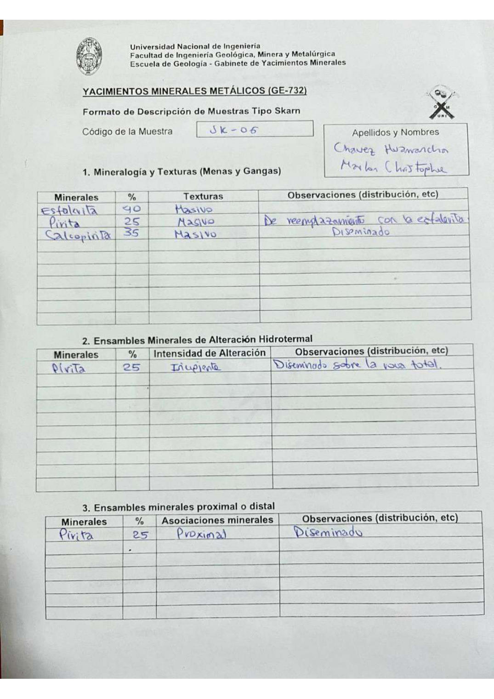

# Muestra SK - 06

- **Autor:** Chavez Huamancha, Marlon Christopher
- **Formato:** GE-732 Tipo Skarn
- **Fuente:** SKARN_MUESTRAS.pdf (pagina 9)
- **Confianza transcripcion:** alta

## 1. Mineralogia y Texturas (Menas y Gangas)
| Mineral | % | Texturas | Observaciones |
|---|---|---|---|
| Esfalerita | 40 | Masivo |  |
| Pirita | 25 | Masivo | De reemplazamiento con la esfalerita |
| Calcopirita | 35 | Masivo | Diseminado |

## 2. Esquema
Dibujo circular (vista de lupa) partido en dos: mitad izquierda anaranjada y rayada (esfalerita) y mitad derecha clara (pirita) con cristales alargados celestes (calcopirita).

_Escala:_ 2 cm

## 3. Ensambles de Minerales de Alteracion
| Mineral | % | Intensidad | Observaciones |
|---|---|---|---|
| Pirita | 25 | incipiente | Diseminado sobre la roca total |

## Ensambles minerales proximal / distal
| Mineral | % | Asociacion | Observaciones |
|---|---|---|---|
| Pirita | 25 | proximal | Diseminado |

## 4. Secuencia paragenetica
Esfalerita y pirita primero, calcopirita despues.
| Mineral / asociacion | Etapa | Notas |
|---|---|---|
| Esfalerita |  |  |
| Pirita |  | Comparte casilla con la esfalerita |
| Calcopirita |  |  |

## 5. Interpretacion
- **Protolito:** 
- **Alteraciones:** Skarn - fase prograda
- **Condiciones Fisico-Quimicas:** Altas temperaturas; pH basico
- **Tipo de Yacimiento:** Skarn

> Notas: Escaneo de hoja manuscrita, leido con vision. Cada muestra ocupa dos paginas (anverso con las secciones 1-3 y reverso con las 4-6) y el PDF NO las trae consecutivas: el emparejamiento se reconstruyo por contenido. El campo 'pagina' apunta al anverso (el que lleva el codigo) y es la imagen guardada en page.jpg. Reverso de esta muestra: pagina 12. El codigo esta escrito 'JK - 06' o 'SK - 06' (la primera letra es ambigua); se transcribe SK por coherencia con el resto de la serie. La casilla Protolito lleva solo unos guiones. En el esquema la etiqueta de la pirita se escribio 'Dirita'.
