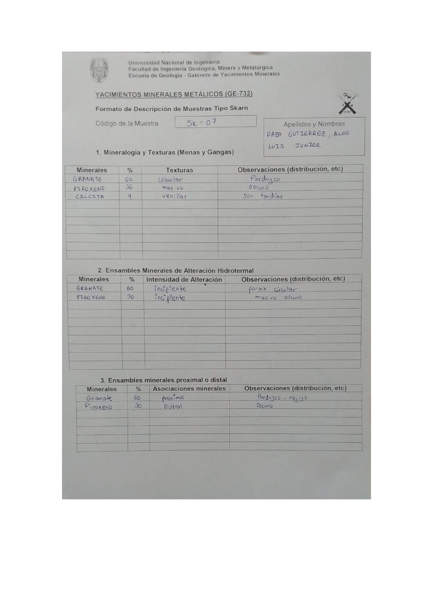

# Muestra SK - 07

- **Autor:** Daza Gutierrez, Aldo Luis Junior
- **Formato:** GE-732 Tipo Skarn
- **Fuente:** YACIMIENTO_SKARN.pdf (pagina 15)
- **Confianza transcripcion:** alta

## 1. Mineralogia y Texturas (Menas y Gangas)
| Mineral | % | Texturas | Observaciones |
|---|---|---|---|
| Granate | 60 | Lobular | Parduzco |
| Piroxeno | 36 | Masivo | Oscuro |
| Calcita | 4 | Venillas | Son tardias |

## 2. Esquema
Dibujo de la muestra de fondo gris (piroxeno) con manchas naranjas lobuladas de granate y venillas celestes de calcita.

_Escala:_ 2 cm

## 3. Ensambles de Minerales de Alteracion
| Mineral | % | Intensidad | Observaciones |
|---|---|---|---|
| Granate | 60 | incipiente | Forma circular |
| Piroxeno | 30 | incipiente | Masivo oscuro |

## Ensambles minerales proximal / distal
| Mineral | % | Asociacion | Observaciones |
|---|---|---|---|
| Granate | 60 | proximal | Parduzco-rojizo |
| Piroxeno | 30 | distal | Oscuro |

## 4. Secuencia paragenetica
Granate primero, luego piroxeno y finalmente calcita.
| Mineral / asociacion | Etapa | Notas |
|---|---|---|
| Granate |  |  |
| Piroxeno |  |  |
| Calcita |  |  |

## 5. Interpretacion
- **Protolito:** Prograda skarn
- **Alteraciones:** Prograda skarn
- **Condiciones Fisico-Quimicas:** Altas temperaturas; pH basico
- **Tipo de Yacimiento:** Skarn

> Notas: Escaneo de hoja manuscrita, leido con vision. Cada muestra ocupa dos paginas consecutivas (anverso con las secciones 1-3 y reverso con las 4-6). El campo 'pagina' apunta al anverso, que es la imagen guardada en page.jpg. Reverso de esta muestra: pagina 16. ATENCION: el codigo 'SK-07' ya lo usa una muestra de Aguilar Peralta (YACIMIENTOS-AGUILAR_PERALTA_JOSE_LUIS.pdf p23), que es otra muestra; por eso esta se guarda en SK-07-b. Es la misma muestra que SK-01 de Chavez Huamancha (SKARN_MUESTRAS.pdf p11): granate 60, piroxeno 36 y calcita 4. El piroxeno figura con 36 % en la tabla 1 y con 30 % en las tablas 2 y 3.
