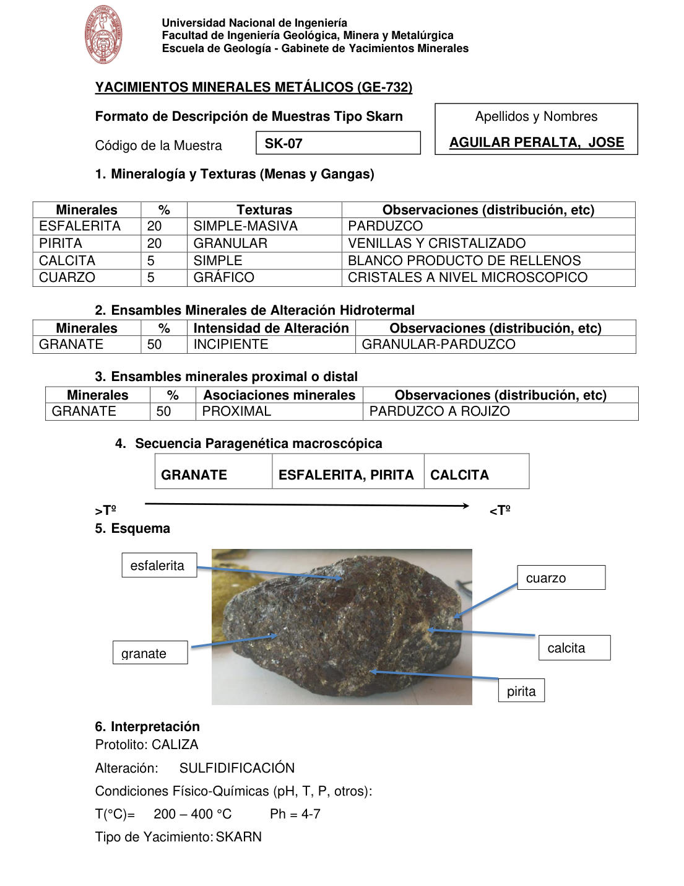

# Muestra SK-07

- **Autor:** Aguilar Peralta, Jose Luis
- **Formato:** GE-732 Tipo Skarn
- **Fuente:** YACIMIENTOS-AGUILAR_PERALTA_JOSE_LUIS.pdf (pagina 23)
- **Confianza transcripcion:** alta

## 1. Mineralogia y Texturas (Menas y Gangas)
| Mineral | % | Texturas | Observaciones |
|---|---|---|---|
| Esfalerita | 20 | Simple-masiva | Parduzco |
| Pirita | 20 | Granular | Venillas y cristalizado |
| Calcita | 5 | Simple | Blanco, producto de rellenos |
| Cuarzo | 5 | Grafico | Cristales a nivel microscopico |

## 2. Esquema
Fotografia de la muestra de mano, pardo oscura. Etiquetas: esfalerita, granate, cuarzo, calcita y pirita.

## 3. Ensambles de Minerales de Alteracion
| Mineral | % | Intensidad | Observaciones |
|---|---|---|---|
| Granate | 50 | incipiente | Granular-parduzco |

## Ensambles minerales proximal / distal
| Mineral | % | Asociacion | Observaciones |
|---|---|---|---|
| Granate | 50 | proximal | Parduzco a rojizo |

## 4. Secuencia paragenetica
De mayor a menor temperatura: granate; esfalerita y pirita; calcita.
| Mineral / asociacion | Etapa | Notas |
|---|---|---|
| Granate |  |  |
| Esfalerita, Pirita |  | Comparten casilla en la hoja |
| Calcita |  |  |

## 5. Interpretacion
- **Protolito:** Caliza
- **Alteraciones:** Sulfidificacion
- **Condiciones Fisico-Quimicas:** T = 200-400 C; pH = 4-7
- **Tipo de Yacimiento:** Skarn

> Notas: PDF digital (texto seleccionable), no manuscrito: la transcripcion es literal. Hoja del formato 'YACIMIENTOS MINERALES METALICOS (GE-732) - Formato de Descripcion de Muestras Tipo Skarn', que trae una seccion 'Ensambles minerales proximal o distal' (campo ensambles_proximal_distal) ausente del GE-701. El esquema es una fotografia de la muestra de mano. Grupo del informe: C) Yacimiento tipo skarn (separador en pagina 22). Los porcentajes de la tabla 1 suman 50 %; el granate (50 %) solo figura en las tablas 2 y 3.
