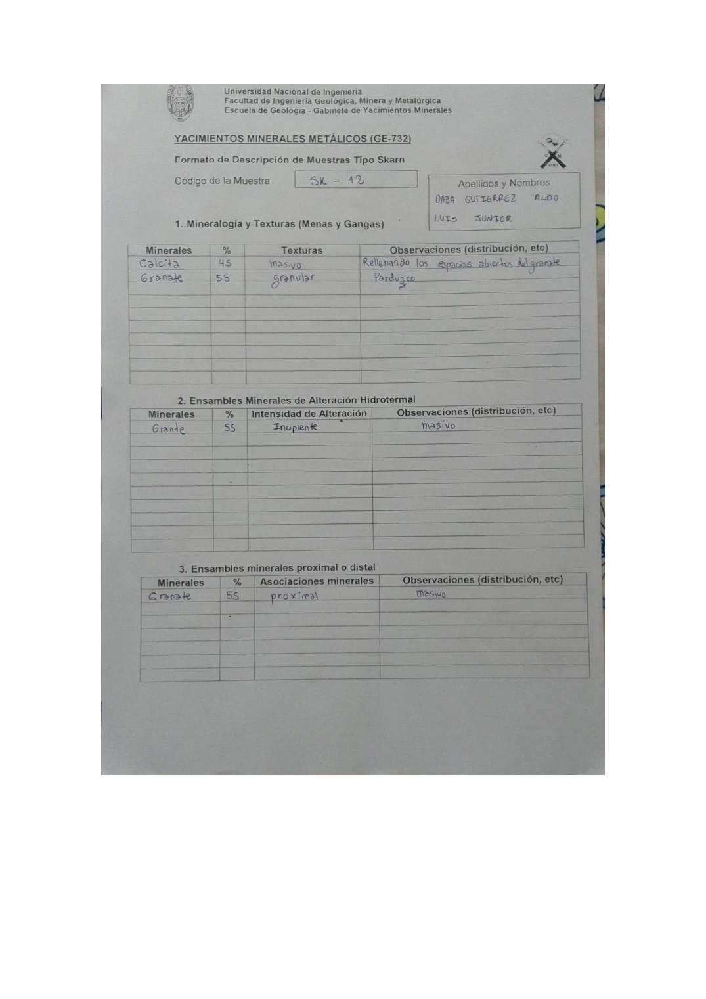

# Muestra SK - 12

- **Autor:** Daza Gutierrez, Aldo Luis Junior
- **Formato:** GE-732 Tipo Skarn
- **Fuente:** YACIMIENTO_SKARN.pdf (pagina 17)
- **Confianza transcripcion:** alta

## 1. Mineralogia y Texturas (Menas y Gangas)
| Mineral | % | Texturas | Observaciones |
|---|---|---|---|
| Calcita | 45 | Masivo | Rellenando los espacios abiertos del granate |
| Granate | 55 | Granular | Parduzco |

## 2. Esquema
Dibujo de la muestra de fondo pardo-rojizo (granate) con una zona central celeste moteada de calcita y una esquina gris.

_Escala:_ 2 cm

## 3. Ensambles de Minerales de Alteracion
| Mineral | % | Intensidad | Observaciones |
|---|---|---|---|
| Granate | 55 | incipiente | Masivo |

## Ensambles minerales proximal / distal
| Mineral | % | Asociacion | Observaciones |
|---|---|---|---|
| Granate | 55 | proximal | Masivo |

## 4. Secuencia paragenetica
Granate primero y calcita al final.
| Mineral / asociacion | Etapa | Notas |
|---|---|---|
| Granate |  |  |
| Calcita |  |  |

## 5. Interpretacion
- **Protolito:** 
- **Alteraciones:** 
- **Condiciones Fisico-Quimicas:** Altas temperaturas; pH acido
- **Tipo de Yacimiento:** Skarn (endoskarn)

> Notas: Escaneo de hoja manuscrita, leido con vision. Cada muestra ocupa dos paginas consecutivas (anverso con las secciones 1-3 y reverso con las 4-6). El campo 'pagina' apunta al anverso, que es la imagen guardada en page.jpg. Reverso de esta muestra: pagina 18. Las casillas Protolito y Alteracion quedaron vacias. En la tabla 2 el granate figura escrito 'Grante'.
