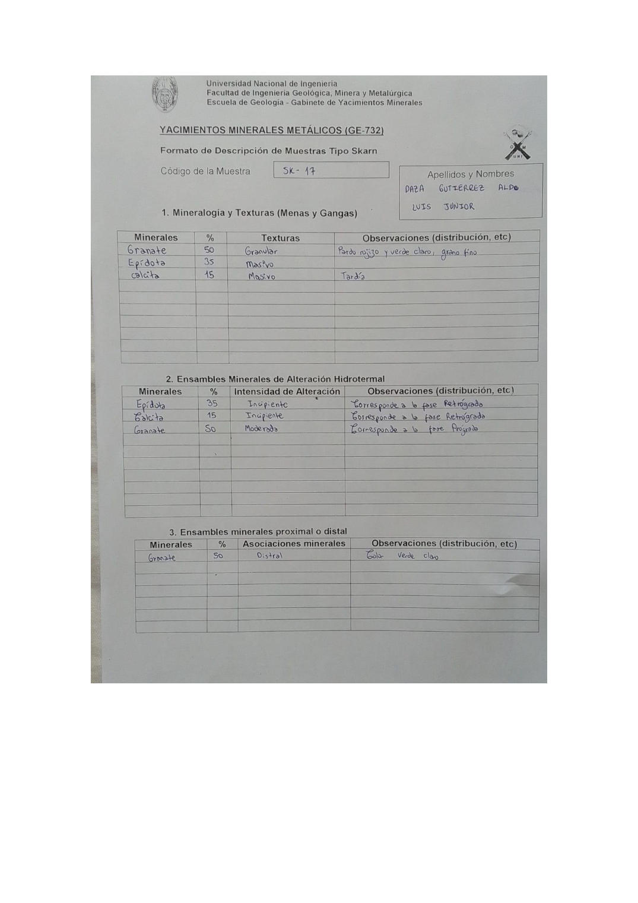

# Muestra SK - 17

- **Autor:** Daza Gutierrez, Aldo Luis Junior
- **Formato:** GE-732 Tipo Skarn
- **Fuente:** YACIMIENTO_SKARN.pdf (pagina 11)
- **Confianza transcripcion:** alta

## 1. Mineralogia y Texturas (Menas y Gangas)
| Mineral | % | Texturas | Observaciones |
|---|---|---|---|
| Granate | 50 | Granular | Pardo rojizo y verde claro, grano fino |
| Epidota | 35 | Masivo |  |
| Calcita | 15 | Masivo | Tardia |

## 2. Esquema
Dibujo de la muestra de fondo amarillo con masas negras de granate, una mancha verde de epidota y parches azules de calcita.

_Escala:_ 2 cm

## 3. Ensambles de Minerales de Alteracion
| Mineral | % | Intensidad | Observaciones |
|---|---|---|---|
| Epidota | 35 | incipiente | Corresponde a la fase retrograda |
| Calcita | 15 | incipiente | Corresponde a la fase retrograda |
| Granate | 50 | moderada | Corresponde a la fase prograda |

## Ensambles minerales proximal / distal
| Mineral | % | Asociacion | Observaciones |
|---|---|---|---|
| Granate | 50 | distal | Color verde claro |

## 4. Secuencia paragenetica
Granate, luego epidota y finalmente calcita.
| Mineral / asociacion | Etapa | Notas |
|---|---|---|
| Granate |  |  |
| Epidota |  |  |
| Calcita |  |  |

## 5. Interpretacion
- **Protolito:** 
- **Alteraciones:** Prograda y retrograda separadas por una fractura
- **Condiciones Fisico-Quimicas:** Temperaturas altas (prograda) y bajas (retrograda); pH basico
- **Tipo de Yacimiento:** Skarn

> Notas: Escaneo de hoja manuscrita, leido con vision. Cada muestra ocupa dos paginas consecutivas (anverso con las secciones 1-3 y reverso con las 4-6). El campo 'pagina' apunta al anverso, que es la imagen guardada en page.jpg. Reverso de esta muestra: pagina 12. ATENCION: el codigo 'SK-17' ya lo usa una muestra de Aguilar Peralta (YACIMIENTOS-AGUILAR_PERALTA_JOSE_LUIS.pdf p24), que es otra muestra; por eso esta se guarda en SK-17-b. Es la misma muestra que SK-03 de Chavez Huamancha (SKARN_MUESTRAS.pdf p3): epidota 35, granate 50 y calcita 15. La casilla Protolito quedo vacia.
