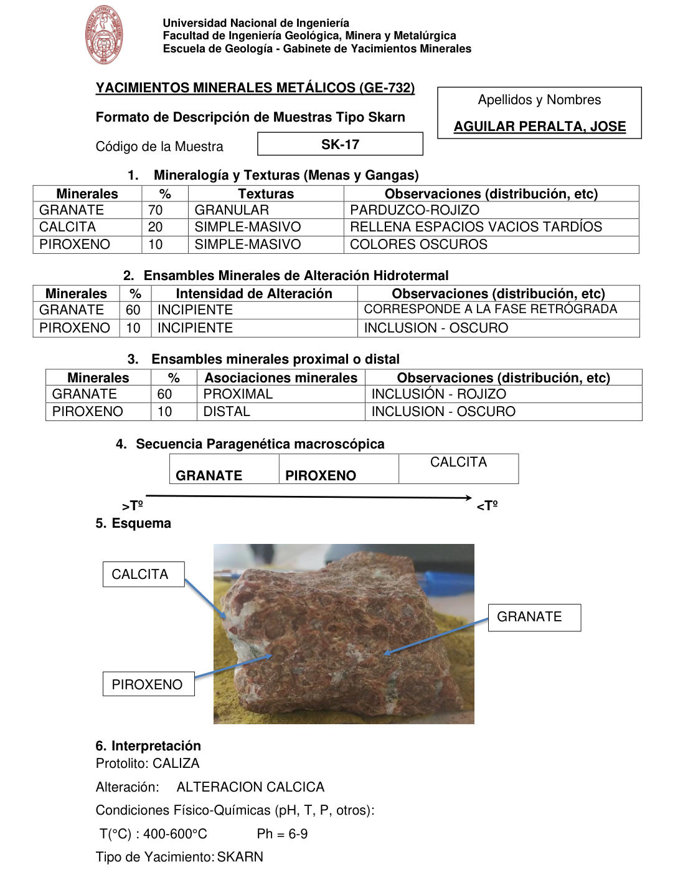

# Muestra SK-17

- **Autor:** Aguilar Peralta, Jose Luis
- **Formato:** GE-732 Tipo Skarn
- **Fuente:** YACIMIENTOS-AGUILAR_PERALTA_JOSE_LUIS.pdf (pagina 24)
- **Confianza transcripcion:** alta

## 1. Mineralogia y Texturas (Menas y Gangas)
| Mineral | % | Texturas | Observaciones |
|---|---|---|---|
| Granate | 70 | Granular | Parduzco-rojizo |
| Calcita | 20 | Simple-masivo | Rellena espacios vacios tardios |
| Piroxeno | 10 | Simple-masivo | Colores oscuros |

## 2. Esquema
Fotografia de la muestra de mano, rojiza y granular. Etiquetas: calcita (vetillas blancas), piroxeno (zonas verdosas) y granate (granos pardo-rojizos).

## 3. Ensambles de Minerales de Alteracion
| Mineral | % | Intensidad | Observaciones |
|---|---|---|---|
| Granate | 60 | incipiente | Corresponde a la fase retrograda |
| Piroxeno | 10 | incipiente | Inclusion, oscuro |

## Ensambles minerales proximal / distal
| Mineral | % | Asociacion | Observaciones |
|---|---|---|---|
| Granate | 60 | proximal | Inclusion, rojizo |
| Piroxeno | 10 | distal | Inclusion, oscuro |

## 4. Secuencia paragenetica
De mayor a menor temperatura: granate, piroxeno y calcita.
| Mineral / asociacion | Etapa | Notas |
|---|---|---|
| Granate |  |  |
| Piroxeno |  |  |
| Calcita |  |  |

## 5. Interpretacion
- **Protolito:** Caliza
- **Alteraciones:** Alteracion calcica
- **Condiciones Fisico-Quimicas:** T = 400-600 C; pH = 6-9
- **Tipo de Yacimiento:** Skarn

> Notas: PDF digital (texto seleccionable), no manuscrito: la transcripcion es literal. Hoja del formato 'YACIMIENTOS MINERALES METALICOS (GE-732) - Formato de Descripcion de Muestras Tipo Skarn', que trae una seccion 'Ensambles minerales proximal o distal' (campo ensambles_proximal_distal) ausente del GE-701. El esquema es una fotografia de la muestra de mano. Grupo del informe: C) Yacimiento tipo skarn (separador en pagina 22).
