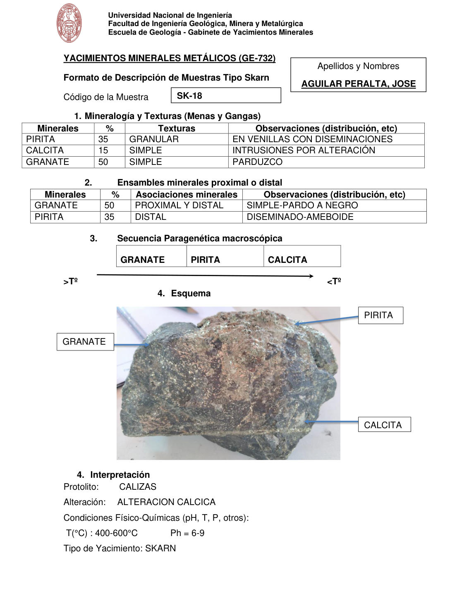

# Muestra SK-18

- **Autor:** Aguilar Peralta, Jose Luis
- **Formato:** GE-732 Tipo Skarn
- **Fuente:** YACIMIENTOS-AGUILAR_PERALTA_JOSE_LUIS.pdf (pagina 25)
- **Confianza transcripcion:** alta

## 1. Mineralogia y Texturas (Menas y Gangas)
| Mineral | % | Texturas | Observaciones |
|---|---|---|---|
| Pirita | 35 | Granular | En venillas con diseminaciones |
| Calcita | 15 | Simple | Intrusiones por alteracion |
| Granate | 50 | Simple | Parduzco |

## 2. Esquema
Fotografia de la muestra de mano, verde-gris oscura con zonas pardas. Etiquetas: granate, pirita y calcita.

## 3. Ensambles de Minerales de Alteracion

## Ensambles minerales proximal / distal
| Mineral | % | Asociacion | Observaciones |
|---|---|---|---|
| Granate | 50 | proximal y distal | Simple, pardo a negro |
| Pirita | 35 | distal | Diseminado-ameboide |

## 4. Secuencia paragenetica
De mayor a menor temperatura: granate, pirita y calcita.
| Mineral / asociacion | Etapa | Notas |
|---|---|---|
| Granate |  |  |
| Pirita |  |  |
| Calcita |  |  |

## 5. Interpretacion
- **Protolito:** Calizas
- **Alteraciones:** Alteracion calcica
- **Condiciones Fisico-Quimicas:** T = 400-600 C; pH = 6-9
- **Tipo de Yacimiento:** Skarn

> Notas: PDF digital (texto seleccionable), no manuscrito: la transcripcion es literal. Hoja del formato 'YACIMIENTOS MINERALES METALICOS (GE-732) - Formato de Descripcion de Muestras Tipo Skarn', que trae una seccion 'Ensambles minerales proximal o distal' (campo ensambles_proximal_distal) ausente del GE-701. El esquema es una fotografia de la muestra de mano. Grupo del informe: C) Yacimiento tipo skarn (separador en pagina 22). Esta hoja NO trae la tabla de ensambles de alteracion hidrotermal; pasa de la seccion 1 a 'Ensambles minerales proximal o distal'. La numeracion de la hoja repite el 4 (Esquema e Interpretacion).
