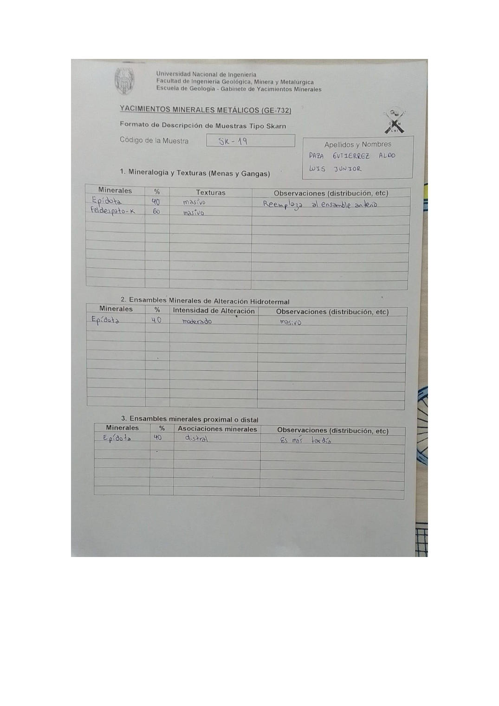

# Muestra SK - 19

- **Autor:** Daza Gutierrez, Aldo Luis Junior
- **Formato:** GE-732 Tipo Skarn
- **Fuente:** YACIMIENTO_SKARN.pdf (pagina 9)
- **Confianza transcripcion:** alta

## 1. Mineralogia y Texturas (Menas y Gangas)
| Mineral | % | Texturas | Observaciones |
|---|---|---|---|
| Epidota | 40 | Masivo | Reemplaza al ensamble anterior |
| Feldespato-K | 60 | Masivo |  |

## 2. Esquema
Dibujo de la muestra de fondo rosado (feldespato potasico) con parches verdes irregulares de epidota.

_Escala:_ 2 cm

## 3. Ensambles de Minerales de Alteracion
| Mineral | % | Intensidad | Observaciones |
|---|---|---|---|
| Epidota | 40 | moderada | Masivo |

## Ensambles minerales proximal / distal
| Mineral | % | Asociacion | Observaciones |
|---|---|---|---|
| Epidota | 40 | distal | Es mas tardia |

## 4. Secuencia paragenetica
Feldespato potasico primero y epidota despues.
| Mineral / asociacion | Etapa | Notas |
|---|---|---|
| Feldespato-K |  |  |
| Epidota |  |  |

## 5. Interpretacion
- **Protolito:** 
- **Alteraciones:** Fase retrograda
- **Condiciones Fisico-Quimicas:** Temperatura baja; pH basico
- **Tipo de Yacimiento:** Skarn

> Notas: Escaneo de hoja manuscrita, leido con vision. Cada muestra ocupa dos paginas consecutivas (anverso con las secciones 1-3 y reverso con las 4-6). El campo 'pagina' apunta al anverso, que es la imagen guardada en page.jpg. Reverso de esta muestra: pagina 10. La casilla Protolito quedo vacia. En la tabla proximal/distal figura 'distral' (por distal).
