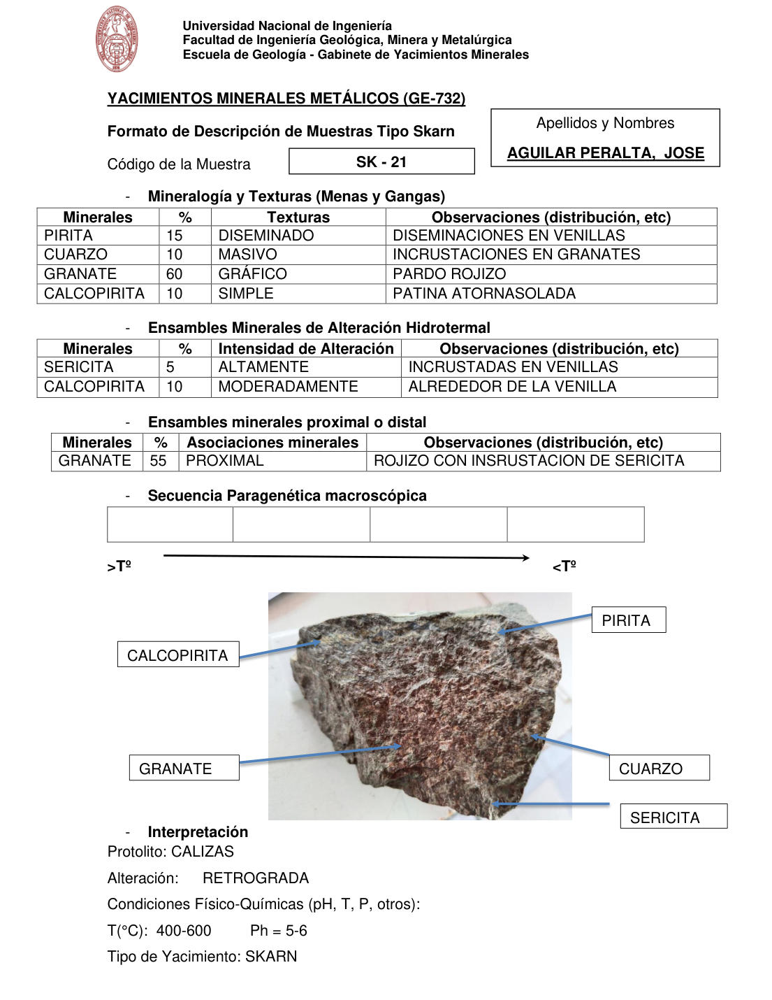

# Muestra SK - 21

- **Autor:** Aguilar Peralta, Jose Luis
- **Formato:** GE-732 Tipo Skarn
- **Fuente:** YACIMIENTOS-AGUILAR_PERALTA_JOSE_LUIS.pdf (pagina 31)
- **Confianza transcripcion:** alta

## 1. Mineralogia y Texturas (Menas y Gangas)
| Mineral | % | Texturas | Observaciones |
|---|---|---|---|
| Pirita | 15 | Diseminado | Diseminaciones en venillas |
| Cuarzo | 10 | Masivo | Incrustaciones en granates |
| Granate | 60 | Grafico | Pardo rojizo |
| Calcopirita | 10 | Simple | Patina atornasolada |

## 2. Esquema
Fotografia de la muestra de mano, pardo-rojiza con zonas claras. Etiquetas: calcopirita, pirita, granate, cuarzo y sericita.

## 3. Ensambles de Minerales de Alteracion
| Mineral | % | Intensidad | Observaciones |
|---|---|---|---|
| Sericita | 5 | altamente | Incrustadas en venillas |
| Calcopirita | 10 | moderadamente | Alrededor de la venilla |

## Ensambles minerales proximal / distal
| Mineral | % | Asociacion | Observaciones |
|---|---|---|---|
| Granate | 55 | proximal | Rojizo con incrustacion de sericita |

## 4. Secuencia paragenetica

## 5. Interpretacion
- **Protolito:** Calizas
- **Alteraciones:** Retrograda
- **Condiciones Fisico-Quimicas:** T = 400-600 C; pH = 5-6
- **Tipo de Yacimiento:** Skarn

> Notas: PDF digital (texto seleccionable), no manuscrito: la transcripcion es literal. Hoja del formato 'YACIMIENTOS MINERALES METALICOS (GE-732) - Formato de Descripcion de Muestras Tipo Skarn', que trae una seccion 'Ensambles minerales proximal o distal' (campo ensambles_proximal_distal) ausente del GE-701. El esquema es una fotografia de la muestra de mano. Grupo del informe: C) Yacimiento tipo skarn (separador en pagina 22). La tabla de secuencia paragenetica esta VACIA en la hoja; no se rellena. El granate figura con 60 % en la tabla 1 y con 55 % en la tabla proximal/distal.
