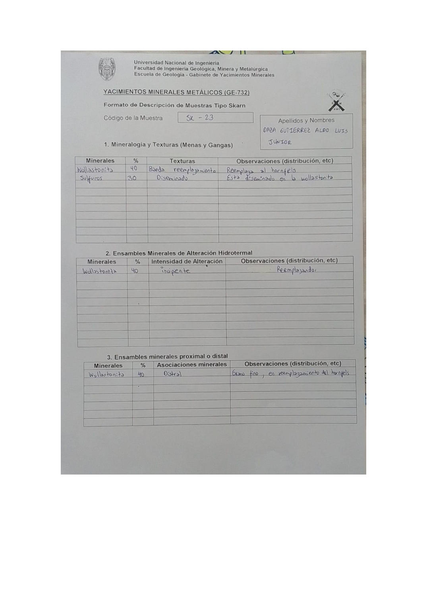

# Muestra SK - 23

- **Autor:** Daza Gutierrez, Aldo Luis Junior
- **Formato:** GE-732 Tipo Skarn
- **Fuente:** YACIMIENTO_SKARN.pdf (pagina 7)
- **Confianza transcripcion:** alta

## 1. Mineralogia y Texturas (Menas y Gangas)
| Mineral | % | Texturas | Observaciones |
|---|---|---|---|
| Wollastonita | 40 | Banda, reemplazamiento | Reemplaza al hornfels |
| Sulfuros | 30 | Diseminado | Esta diseminado en la wollastonita |

## 2. Esquema
Dibujo de la muestra de color celeste (wollastonita) con una banda gris a la izquierda y vetas oscuras sinuosas de sulfuros (Pb-Zn).

_Escala:_ 2 cm

## 3. Ensambles de Minerales de Alteracion
| Mineral | % | Intensidad | Observaciones |
|---|---|---|---|
| Wollastonita | 40 | incipiente | Reemplazando |

## Ensambles minerales proximal / distal
| Mineral | % | Asociacion | Observaciones |
|---|---|---|---|
| Wollastonita | 40 | distal | Grano fino, en reemplazamiento del hornfels |

## 4. Secuencia paragenetica
Wollastonita primero y sulfuros despues.
| Mineral / asociacion | Etapa | Notas |
|---|---|---|
| Wollastonita |  |  |
| Sulfuros |  |  |

## 5. Interpretacion
- **Protolito:** Caliza
- **Alteraciones:** Skarn - fase prograda
- **Condiciones Fisico-Quimicas:** Altas temperaturas; pH basico
- **Tipo de Yacimiento:** Skarn

> Notas: Escaneo de hoja manuscrita, leido con vision. Cada muestra ocupa dos paginas consecutivas (anverso con las secciones 1-3 y reverso con las 4-6). El campo 'pagina' apunta al anverso, que es la imagen guardada en page.jpg. Reverso de esta muestra: pagina 8. Misma muestra que SK-05 de Chavez Huamancha (SKARN_MUESTRAS.pdf p7): wollastonita 40 % reemplazando al hornfels y sulfuros 30 % diseminados.
