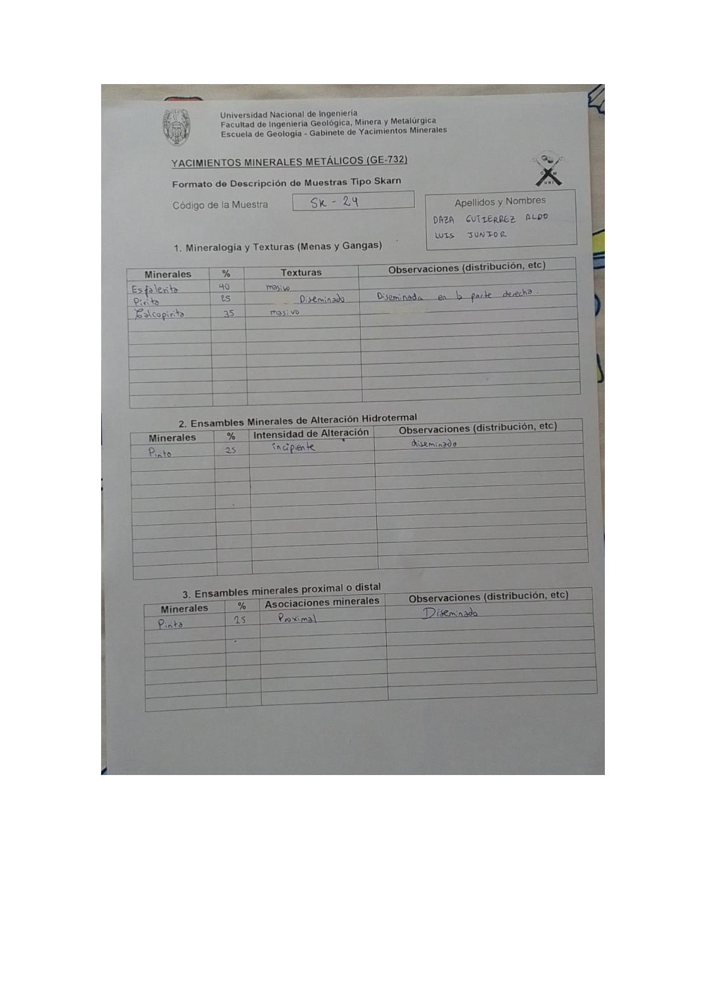

# Muestra SK - 24

- **Autor:** Daza Gutierrez, Aldo Luis Junior
- **Formato:** GE-732 Tipo Skarn
- **Fuente:** YACIMIENTO_SKARN.pdf (pagina 5)
- **Confianza transcripcion:** alta

## 1. Mineralogia y Texturas (Menas y Gangas)
| Mineral | % | Texturas | Observaciones |
|---|---|---|---|
| Esfalerita | 40 | Masivo |  |
| Pirita | 25 | Diseminado | Diseminada en la parte derecha |
| Calcopirita | 35 | Masivo |  |

## 2. Esquema
Dibujo de la muestra partida en dos: mitad izquierda gris (esfalerita) y mitad derecha amarilla (calcopirita) con puntos de pirita en el contacto.

_Escala:_ 2 cm

## 3. Ensambles de Minerales de Alteracion
| Mineral | % | Intensidad | Observaciones |
|---|---|---|---|
| Pirita | 25 | incipiente | Diseminado |

## Ensambles minerales proximal / distal
| Mineral | % | Asociacion | Observaciones |
|---|---|---|---|
| Pirita | 25 | proximal | Diseminado |

## 4. Secuencia paragenetica
Esfalerita y pirita juntas primero, calcopirita despues.
| Mineral / asociacion | Etapa | Notas |
|---|---|---|
| Esfalerita |  | Comparte casilla con la pirita |
| Pirita |  |  |
| Calcopirita |  |  |

## 5. Interpretacion
- **Protolito:** 
- **Alteraciones:** Skarn - fase prograda
- **Condiciones Fisico-Quimicas:** Temperatura alta; pH basico
- **Tipo de Yacimiento:** Skarn

> Notas: Escaneo de hoja manuscrita, leido con vision. Cada muestra ocupa dos paginas consecutivas (anverso con las secciones 1-3 y reverso con las 4-6). El campo 'pagina' apunta al anverso, que es la imagen guardada en page.jpg. Reverso de esta muestra: pagina 6. La casilla Protolito quedo vacia. Misma muestra que SK-06 de Chavez Huamancha (SKARN_MUESTRAS.pdf p9): esfalerita, pirita y calcopirita con los mismos porcentajes.
