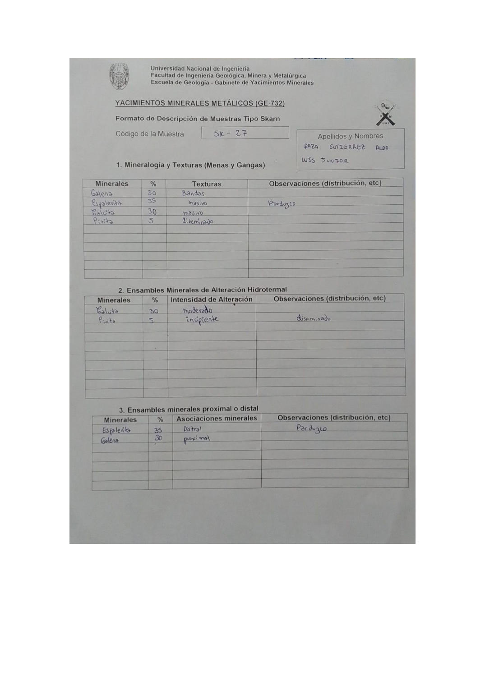

# Muestra SK - 27

- **Autor:** Daza Gutierrez, Aldo Luis Junior
- **Formato:** GE-732 Tipo Skarn
- **Fuente:** YACIMIENTO_SKARN.pdf (pagina 3)
- **Confianza transcripcion:** alta

## 1. Mineralogia y Texturas (Menas y Gangas)
| Mineral | % | Texturas | Observaciones |
|---|---|---|---|
| Galena | 30 | Bandas |  |
| Esfalerita | 35 | Masivo | Parduzco |
| Calcita | 30 | Masivo |  |
| Pirita | 5 | Diseminado |  |

## 2. Esquema
Dibujo de la muestra de fondo gris con bandas azules (galena), granos amarillos (pirita) y parches celestes de esfalerita y calcita, ademas de vetas rosadas.

_Escala:_ 2 cm

## 3. Ensambles de Minerales de Alteracion
| Mineral | % | Intensidad | Observaciones |
|---|---|---|---|
| Calcita | 30 | moderada |  |
| Pirita | 5 | incipiente | Diseminado |

## Ensambles minerales proximal / distal
| Mineral | % | Asociacion | Observaciones |
|---|---|---|---|
| Esfalerita | 35 | distal | Parduzco |
| Galena | 30 | proximal |  |

## 4. Secuencia paragenetica
Galena, esfalerita y pirita juntas a mayor temperatura; calcita al final.
| Mineral / asociacion | Etapa | Notas |
|---|---|---|
| Galena |  | Comparte casilla con esfalerita y pirita |
| Esfalerita |  |  |
| Pirita |  |  |
| Calcita |  |  |

## 5. Interpretacion
- **Protolito:** Marmol
- **Alteraciones:** Alteracion skarn: fase retrograda
- **Condiciones Fisico-Quimicas:** Temperaturas bajas (300-350 C); pH basico
- **Tipo de Yacimiento:** Skarn

> Notas: Escaneo de hoja manuscrita, leido con vision. Cada muestra ocupa dos paginas consecutivas (anverso con las secciones 1-3 y reverso con las 4-6). El campo 'pagina' apunta al anverso, que es la imagen guardada en page.jpg. Reverso de esta muestra: pagina 4. ATENCION: el codigo 'SK-27' ya lo usa una muestra de Aguilar Peralta (YACIMIENTOS-AGUILAR_PERALTA_JOSE_LUIS.pdf p27), que es otra muestra; por eso esta se guarda en SK-27-b.
