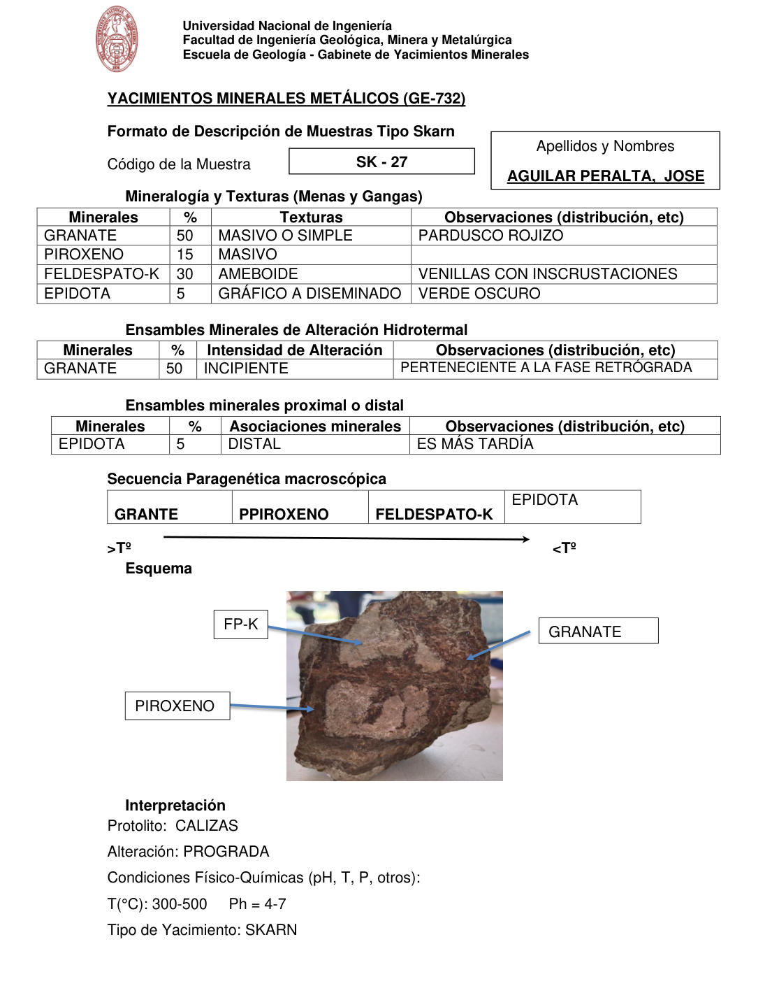

# Muestra SK - 27

- **Autor:** Aguilar Peralta, Jose Luis
- **Formato:** GE-732 Tipo Skarn
- **Fuente:** YACIMIENTOS-AGUILAR_PERALTA_JOSE_LUIS.pdf (pagina 27)
- **Confianza transcripcion:** alta

## 1. Mineralogia y Texturas (Menas y Gangas)
| Mineral | % | Texturas | Observaciones |
|---|---|---|---|
| Granate | 50 | Masivo o simple | Pardusco rojizo |
| Piroxeno | 15 | Masivo |  |
| Feldespato-K | 30 | Ameboide | Venillas con incrustaciones |
| Epidota | 5 | Grafico a diseminado | Verde oscuro |

## 2. Esquema
Fotografia de la muestra de mano, pardo-rojiza con parches claros. Etiquetas: FP-K (feldespato potasico), granate y piroxeno.

## 3. Ensambles de Minerales de Alteracion
| Mineral | % | Intensidad | Observaciones |
|---|---|---|---|
| Granate | 50 | incipiente | Perteneciente a la fase retrograda |

## Ensambles minerales proximal / distal
| Mineral | % | Asociacion | Observaciones |
|---|---|---|---|
| Epidota | 5 | distal | Es mas tardia |

## 4. Secuencia paragenetica
De mayor a menor temperatura: granate, piroxeno, feldespato-K y epidota.
| Mineral / asociacion | Etapa | Notas |
|---|---|---|
| Granate |  |  |
| Piroxeno |  |  |
| Feldespato-K |  |  |
| Epidota |  |  |

## 5. Interpretacion
- **Protolito:** Calizas
- **Alteraciones:** Prograda
- **Condiciones Fisico-Quimicas:** T = 300-500 C; pH = 4-7
- **Tipo de Yacimiento:** Skarn

> Notas: PDF digital (texto seleccionable), no manuscrito: la transcripcion es literal. Hoja del formato 'YACIMIENTOS MINERALES METALICOS (GE-732) - Formato de Descripcion de Muestras Tipo Skarn', que trae una seccion 'Ensambles minerales proximal o distal' (campo ensambles_proximal_distal) ausente del GE-701. El esquema es una fotografia de la muestra de mano. Grupo del informe: C) Yacimiento tipo skarn (separador en pagina 22). En la secuencia paragenetica el original escribe 'GRANTE' y 'PPIROXENO' (erratas por granate y piroxeno). Las secciones de esta hoja van sin numerar.
