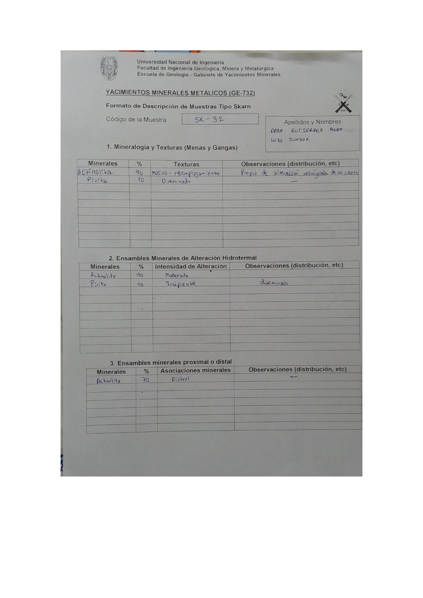

# Muestra SK - 32

- **Autor:** Daza Gutierrez, Aldo Luis Junior
- **Formato:** GE-732 Tipo Skarn
- **Fuente:** YACIMIENTO_SKARN.pdf (pagina 1)
- **Confianza transcripcion:** alta

## 1. Mineralogia y Texturas (Menas y Gangas)
| Mineral | % | Texturas | Observaciones |
|---|---|---|---|
| Actinolita | 90 | Masivo - reemplazamiento | Propio de alteracion retrograda de un skarn |
| Pirita | 10 | Diseminado |  |

## 2. Esquema
Dibujo de la muestra de color verde uniforme (actinolita) con una mancha turquesa central senalada como actinolita y puntos amarillos de pirita a la izquierda.

## 3. Ensambles de Minerales de Alteracion
| Mineral | % | Intensidad | Observaciones |
|---|---|---|---|
| Actinolita | 90 | moderada |  |
| Pirita | 10 | incipiente | Diseminado |

## Ensambles minerales proximal / distal
| Mineral | % | Asociacion | Observaciones |
|---|---|---|---|
| Actinolita | 70 | distal |  |

## 4. Secuencia paragenetica
Actinolita primero y pirita despues.
| Mineral / asociacion | Etapa | Notas |
|---|---|---|
| Actinolita |  |  |
| Pirita |  |  |

## 5. Interpretacion
- **Protolito:** 
- **Alteraciones:** Fase retrograda
- **Condiciones Fisico-Quimicas:** Baja temperatura; pH basico
- **Tipo de Yacimiento:** Skarn

> Notas: Escaneo de hoja manuscrita, leido con vision. Cada muestra ocupa dos paginas consecutivas (anverso con las secciones 1-3 y reverso con las 4-6). El campo 'pagina' apunta al anverso, que es la imagen guardada en page.jpg. Reverso de esta muestra: pagina 2. La actinolita figura con 90 % en las tablas 1 y 2, pero con 70 % en la tabla proximal/distal. La casilla Protolito quedo vacia.
