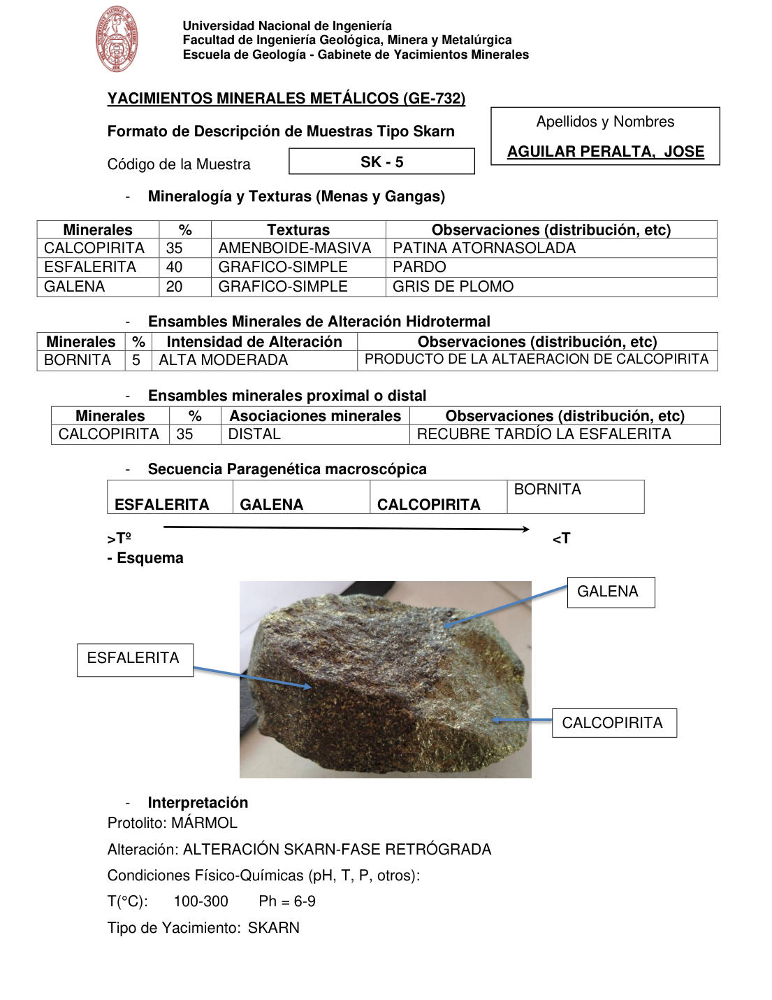

# Muestra SK - 5

- **Autor:** Aguilar Peralta, Jose Luis
- **Formato:** GE-732 Tipo Skarn
- **Fuente:** YACIMIENTOS-AGUILAR_PERALTA_JOSE_LUIS.pdf (pagina 29)
- **Confianza transcripcion:** alta

## 1. Mineralogia y Texturas (Menas y Gangas)
| Mineral | % | Texturas | Observaciones |
|---|---|---|---|
| Calcopirita | 35 | Ameboide-masiva | Patina atornasolada |
| Esfalerita | 40 | Grafico-simple | Pardo |
| Galena | 20 | Grafico-simple | Gris de plomo |

## 2. Esquema
Fotografia de la muestra de mano, masiva, pardo oscura con brillo metalico. Etiquetas: esfalerita, galena y calcopirita.

## 3. Ensambles de Minerales de Alteracion
| Mineral | % | Intensidad | Observaciones |
|---|---|---|---|
| Bornita | 5 | alta moderada | Producto de la alteracion de calcopirita |

## Ensambles minerales proximal / distal
| Mineral | % | Asociacion | Observaciones |
|---|---|---|---|
| Calcopirita | 35 | distal | Recubre tardio la esfalerita |

## 4. Secuencia paragenetica
De mayor a menor temperatura: esfalerita, galena, calcopirita y bornita.
| Mineral / asociacion | Etapa | Notas |
|---|---|---|
| Esfalerita |  |  |
| Galena |  |  |
| Calcopirita |  |  |
| Bornita |  |  |

## 5. Interpretacion
- **Protolito:** Marmol
- **Alteraciones:** Alteracion skarn, fase retrograda
- **Condiciones Fisico-Quimicas:** T = 100-300 C; pH = 6-9
- **Tipo de Yacimiento:** Skarn

> Notas: PDF digital (texto seleccionable), no manuscrito: la transcripcion es literal. Hoja del formato 'YACIMIENTOS MINERALES METALICOS (GE-732) - Formato de Descripcion de Muestras Tipo Skarn', que trae una seccion 'Ensambles minerales proximal o distal' (campo ensambles_proximal_distal) ausente del GE-701. El esquema es una fotografia de la muestra de mano. Grupo del informe: C) Yacimiento tipo skarn (separador en pagina 22). En la tabla 1 el original escribe 'AMENBOIDE' (errata por ameboide) y en la tabla 2 'ALTAERACION'.
