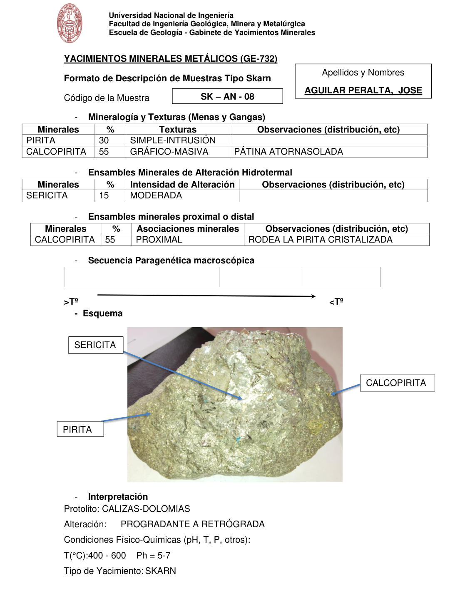

# Muestra SK - AN - 08

- **Autor:** Aguilar Peralta, Jose Luis
- **Formato:** GE-732 Tipo Skarn
- **Fuente:** YACIMIENTOS-AGUILAR_PERALTA_JOSE_LUIS.pdf (pagina 28)
- **Confianza transcripcion:** alta

## 1. Mineralogia y Texturas (Menas y Gangas)
| Mineral | % | Texturas | Observaciones |
|---|---|---|---|
| Pirita | 30 | Simple-intrusion |  |
| Calcopirita | 55 | Grafico-masiva | Patina atornasolada |

## 2. Esquema
Fotografia de la muestra de mano, masiva y de brillo metalico amarillo. Etiquetas: sericita, pirita y calcopirita.

## 3. Ensambles de Minerales de Alteracion
| Mineral | % | Intensidad | Observaciones |
|---|---|---|---|
| Sericita | 15 | moderada |  |

## Ensambles minerales proximal / distal
| Mineral | % | Asociacion | Observaciones |
|---|---|---|---|
| Calcopirita | 55 | proximal | Rodea la pirita cristalizada |

## 4. Secuencia paragenetica

## 5. Interpretacion
- **Protolito:** Calizas-dolomias
- **Alteraciones:** Progradante a retrograda
- **Condiciones Fisico-Quimicas:** T = 400-600 C; pH = 5-7
- **Tipo de Yacimiento:** Skarn

> Notas: PDF digital (texto seleccionable), no manuscrito: la transcripcion es literal. Hoja del formato 'YACIMIENTOS MINERALES METALICOS (GE-732) - Formato de Descripcion de Muestras Tipo Skarn', que trae una seccion 'Ensambles minerales proximal o distal' (campo ensambles_proximal_distal) ausente del GE-701. El esquema es una fotografia de la muestra de mano. Grupo del informe: C) Yacimiento tipo skarn (separador en pagina 22). La tabla de secuencia paragenetica esta VACIA en la hoja; no se rellena. Las secciones van marcadas con guiones, sin numerar.
