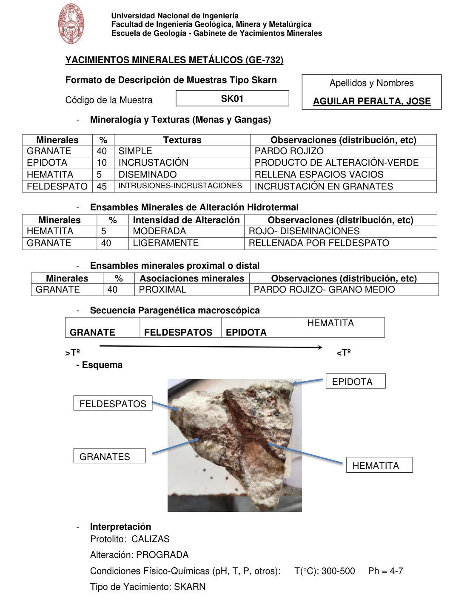

# Muestra SK01

- **Autor:** Aguilar Peralta, Jose Luis
- **Formato:** GE-732 Tipo Skarn
- **Fuente:** YACIMIENTOS-AGUILAR_PERALTA_JOSE_LUIS.pdf (pagina 30)
- **Confianza transcripcion:** alta

## 1. Mineralogia y Texturas (Menas y Gangas)
| Mineral | % | Texturas | Observaciones |
|---|---|---|---|
| Granate | 40 | Simple | Pardo rojizo |
| Epidota | 10 | Incrustacion | Producto de alteracion, verde |
| Hematita | 5 | Diseminado | Rellena espacios vacios |
| Feldespato | 45 | Intrusiones-incrustaciones | Incrustacion en granates |

## 2. Esquema
Fotografia de la muestra de mano, clara con una banda pardo-rojiza central. Etiquetas: feldespatos, granates, epidota y hematita.

## 3. Ensambles de Minerales de Alteracion
| Mineral | % | Intensidad | Observaciones |
|---|---|---|---|
| Hematita | 5 | moderada | Rojo, diseminaciones |
| Granate | 40 | ligeramente | Rellenada por feldespato |

## Ensambles minerales proximal / distal
| Mineral | % | Asociacion | Observaciones |
|---|---|---|---|
| Granate | 40 | proximal | Pardo rojizo, grano medio |

## 4. Secuencia paragenetica
De mayor a menor temperatura: granate, feldespatos, epidota y hematita.
| Mineral / asociacion | Etapa | Notas |
|---|---|---|
| Granate |  |  |
| Feldespatos |  |  |
| Epidota |  |  |
| Hematita |  |  |

## 5. Interpretacion
- **Protolito:** Calizas
- **Alteraciones:** Prograda
- **Condiciones Fisico-Quimicas:** T = 300-500 C; pH = 4-7
- **Tipo de Yacimiento:** Skarn

> Notas: PDF digital (texto seleccionable), no manuscrito: la transcripcion es literal. Hoja del formato 'YACIMIENTOS MINERALES METALICOS (GE-732) - Formato de Descripcion de Muestras Tipo Skarn', que trae una seccion 'Ensambles minerales proximal o distal' (campo ensambles_proximal_distal) ausente del GE-701. El esquema es una fotografia de la muestra de mano. Grupo del informe: C) Yacimiento tipo skarn (separador en pagina 22).
