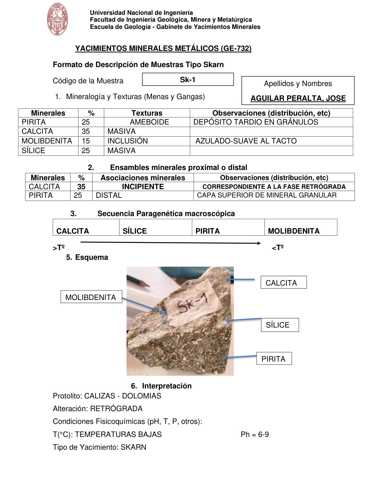

# Muestra Sk-1

- **Autor:** Aguilar Peralta, Jose Luis
- **Formato:** GE-732 Tipo Skarn
- **Fuente:** YACIMIENTOS-AGUILAR_PERALTA_JOSE_LUIS.pdf (pagina 26)
- **Confianza transcripcion:** alta

## 1. Mineralogia y Texturas (Menas y Gangas)
| Mineral | % | Texturas | Observaciones |
|---|---|---|---|
| Pirita | 25 | Ameboide | Deposito tardio en granulos |
| Calcita | 35 | Masiva |  |
| Molibdenita | 15 | Inclusion | Azulado, suave al tacto |
| Silice | 25 | Masiva |  |

## 2. Esquema
Fotografia de la muestra de mano con rotulo 'Sk-1', de tono pardo claro y grano grueso. Etiquetas: calcita, molibdenita, silice y pirita.

## 3. Ensambles de Minerales de Alteracion

## Ensambles minerales proximal / distal
| Mineral | % | Asociacion | Observaciones |
|---|---|---|---|
| Calcita | 35 | incipiente | Correspondiente a la fase retrograda |
| Pirita | 25 | distal | Capa superior de mineral granular |

## 4. Secuencia paragenetica
De mayor a menor temperatura: calcita, silice, pirita y molibdenita.
| Mineral / asociacion | Etapa | Notas |
|---|---|---|
| Calcita |  |  |
| Silice |  |  |
| Pirita |  |  |
| Molibdenita |  |  |

## 5. Interpretacion
- **Protolito:** Calizas - dolomias
- **Alteraciones:** Retrograda
- **Condiciones Fisico-Quimicas:** T = temperaturas bajas; pH = 6-9
- **Tipo de Yacimiento:** Skarn

> Notas: PDF digital (texto seleccionable), no manuscrito: la transcripcion es literal. Hoja del formato 'YACIMIENTOS MINERALES METALICOS (GE-732) - Formato de Descripcion de Muestras Tipo Skarn', que trae una seccion 'Ensambles minerales proximal o distal' (campo ensambles_proximal_distal) ausente del GE-701. El esquema es una fotografia de la muestra de mano. Grupo del informe: C) Yacimiento tipo skarn (separador en pagina 22). Esta hoja NO trae la tabla de ensambles de alteracion hidrotermal. En la tabla proximal/distal la fila de calcita dice 'INCIPIENTE' en la columna de asociaciones (donde se espera proximal/distal); se transcribe tal cual. Numeracion de secciones: 1, 2, 3, 5, 6.
