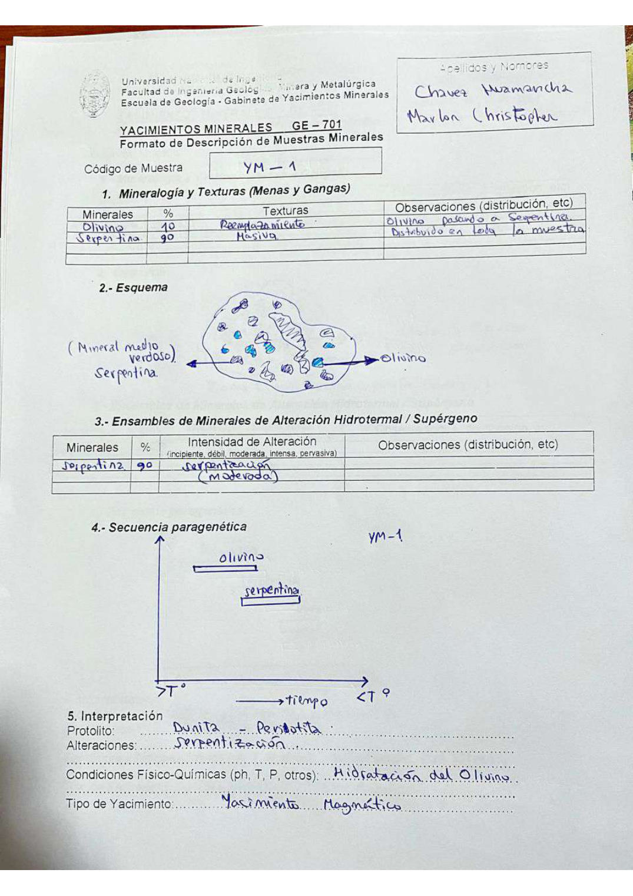

# Muestra YM - 1

- **Autor:** Chavez Huamancha, Marlon Christopher
- **Fuente:** MAGMATICOS_MUESTRAS.pdf (pagina 2)
- **Confianza transcripcion:** alta

## 1. Mineralogia y Texturas (Menas y Gangas)
| Mineral | % | Texturas | Observaciones |
|---|---|---|---|
| Olivino | 10 | Reemplazamiento | Olivino pasando a serpentina |
| Serpentina | 90 | Masiva | Distribuido en toda la muestra |

## 2. Esquema
Dibujo de la muestra: matriz de mineral medio verdoso (serpentina) con granos azulados de olivino repartidos por toda la roca.

## 3. Ensambles de Minerales de Alteracion
| Mineral | % | Intensidad | Observaciones |
|---|---|---|---|
| Serpentina | 90 | moderada | Serpentinizacion |

## 4. Secuencia paragenetica
Olivino a mayor temperatura y serpentina despues.
| Mineral / asociacion | Etapa | Notas |
|---|---|---|
| Olivino |  |  |
| Serpentina |  |  |

## 5. Interpretacion
- **Protolito:** Dunita - Peridotita
- **Alteraciones:** Serpentinizacion
- **Condiciones Fisico-Quimicas:** Hidratacion del olivino
- **Tipo de Yacimiento:** Yacimiento magmatico

> Notas: Escaneo de hoja manuscrita, leido con vision. Carpeta = codigo saneado, colapsando los espacios alrededor de los guiones (p.ej. 'MA - T - 19' -> MA-T-19). En la tabla 3 la intensidad figura como 'serpentinizacion (moderada)'. Misma muestra que MA-T-66 (Daza Gutierrez, MAGMATICOS.pdf p1): porcentajes y observaciones coinciden literalmente.
