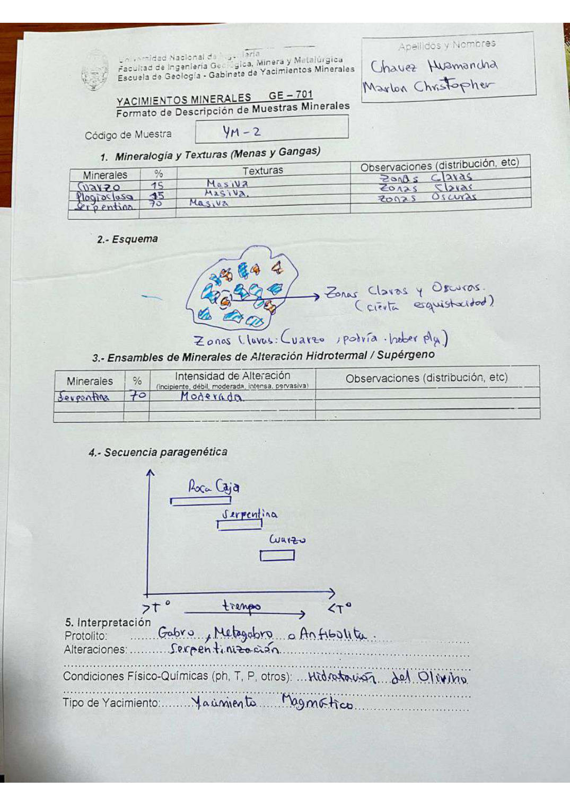

# Muestra YM - 2

- **Autor:** Chavez Huamancha, Marlon Christopher
- **Fuente:** MAGMATICOS_MUESTRAS.pdf (pagina 3)
- **Confianza transcripcion:** alta

## 1. Mineralogia y Texturas (Menas y Gangas)
| Mineral | % | Texturas | Observaciones |
|---|---|---|---|
| Cuarzo | 15 | Masiva | Zonas claras |
| Plagioclasa | 15 | Masiva | Zonas claras |
| Serpentina | 70 | Masiva | Zonas oscuras |

## 2. Esquema
Dibujo con zonas claras y oscuras (cierta esquistosidad); las zonas claras son cuarzo y posiblemente plagioclasa, sobre fondo de serpentina.

## 3. Ensambles de Minerales de Alteracion
| Mineral | % | Intensidad | Observaciones |
|---|---|---|---|
| Serpentina | 70 | moderada |  |

## 4. Secuencia paragenetica
Roca caja, luego serpentina y finalmente cuarzo.
| Mineral / asociacion | Etapa | Notas |
|---|---|---|
| Roca caja |  |  |
| Serpentina |  |  |
| Cuarzo |  |  |

## 5. Interpretacion
- **Protolito:** Gabro, metagabro o anfibolita
- **Alteraciones:** Serpentinizacion
- **Condiciones Fisico-Quimicas:** Hidratacion del olivino
- **Tipo de Yacimiento:** Yacimiento magmatico

> Notas: Escaneo de hoja manuscrita, leido con vision. Carpeta = codigo saneado, colapsando los espacios alrededor de los guiones (p.ej. 'MA - T - 19' -> MA-T-19). El % de la plagioclasa esta reescrito encima (se lee 45 sobre 15); se transcribe 15, que es lo que cuadra con el 15/15/70 de la hoja gemela MA-T-62 (Daza Gutierrez, MAGMATICOS.pdf p9), que describe esta misma muestra.
