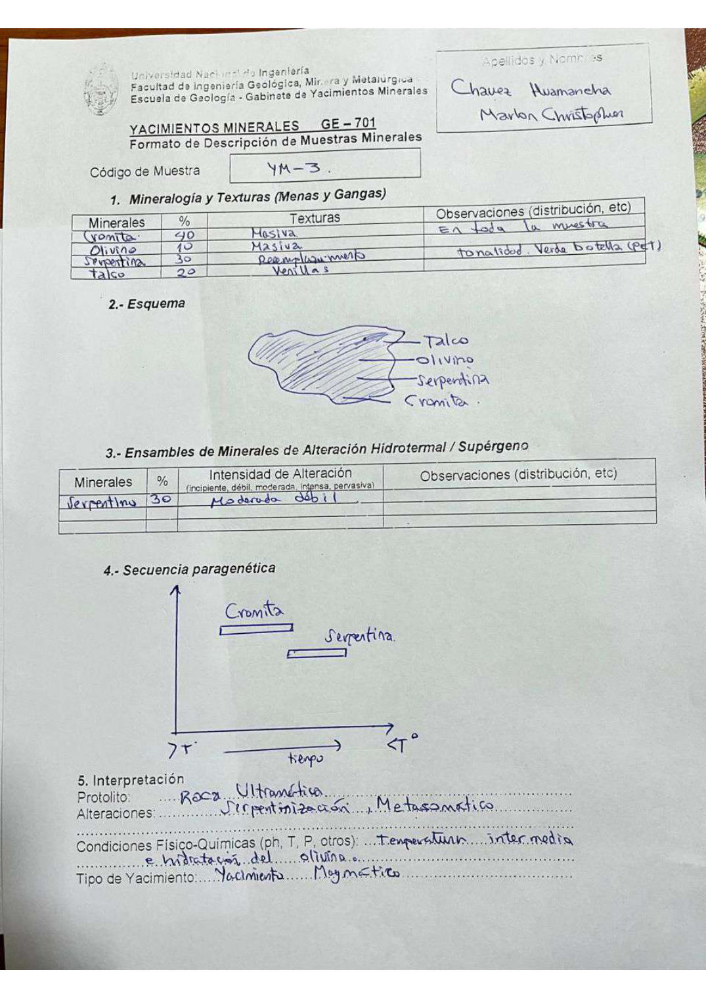

# Muestra YM - 3

- **Autor:** Chavez Huamancha, Marlon Christopher
- **Fuente:** MAGMATICOS_MUESTRAS.pdf (pagina 10)
- **Confianza transcripcion:** alta

## 1. Mineralogia y Texturas (Menas y Gangas)
| Mineral | % | Texturas | Observaciones |
|---|---|---|---|
| Cromita | 40 | Masiva | En toda la muestra |
| Olivino | 10 | Masiva |  |
| Serpentina | 30 | Reemplazamiento | Tonalidad verde botella |
| Talco | 20 | Venillas |  |

## 2. Esquema
Dibujo del contorno de la muestra con cuatro etiquetas de arriba abajo: talco, olivino, serpentina y cromita.

## 3. Ensambles de Minerales de Alteracion
| Mineral | % | Intensidad | Observaciones |
|---|---|---|---|
| Serpentina | 30 | moderada a debil |  |

## 4. Secuencia paragenetica
Cromita a mayor temperatura y serpentina despues.
| Mineral / asociacion | Etapa | Notas |
|---|---|---|
| Cromita |  |  |
| Serpentina |  |  |

## 5. Interpretacion
- **Protolito:** Roca ultramafica
- **Alteraciones:** Serpentinizacion, metasomatico
- **Condiciones Fisico-Quimicas:** Temperatura intermedia e hidratacion del olivino
- **Tipo de Yacimiento:** Yacimiento magmatico

> Notas: Escaneo de hoja manuscrita, leido con vision. Carpeta = codigo saneado, colapsando los espacios alrededor de los guiones (p.ej. 'MA - T - 19' -> MA-T-19). La observacion 'tonalidad verde botella' esta escrita a caballo entre las filas de olivino y serpentina; se asigna a la serpentina, como en la hoja gemela MA-T-64 (Daza Gutierrez, MAGMATICOS.pdf p7), que describe esta misma muestra con los mismos porcentajes. La intensidad de alteracion dice 'Moderada debil'.
